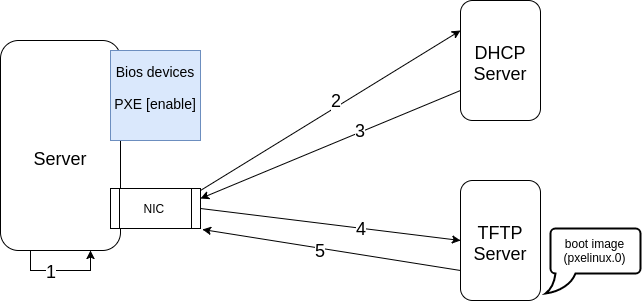
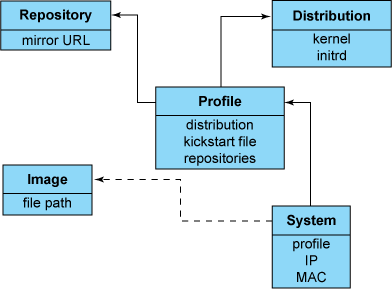

## **Cobbler**

-----

### **Mục lục**
- [1. Overview of PXE](#pxe_overview)
- [2. Cobbler](#cobbler_introduce)
	* [2.1 Cobbler là gì](#what_is_cobbler)
	* [2.2  Các thành phần trong cobbler](#cobbler_component)
	* [2.3 Cài đặt và cấu hình cho cobbler](#cobbler_install_and_configure)
- [3. Sử dụng cobbler](#use_cobbler)
	* [3.1 Importing Your First Distribution](#import_first_distro)
	* [3.2 Kickstart file](#kickstart_file)
	* [3.3 Test](#test)

---

Trước khi tìm hiểu về cobbler, ta cần hiểu được concept về **PXE** và kiến thức về cách cài đặt tự động distro mà ta chọn.


<a name="pxe_overview"></a>
### **1. Overview of PXE**

PXE (Preboot eXecution Environment) - còn được gọi là **pixie** là 1 phương pháp tạo ra 1 máy tính (client) được boot lên từ card mạng của máy tính đó. Phương pháp booting này được tạo ra từ năm 1999, chỉ cần máy tính cần tạo ra được kết nối với network, nghĩa là phải có card mạng và card mạng này phải được hỗ trợ cách booting bằng PXE. (PXE not support wireless  NICs - at 2012)

Vậy cách booting PXE này **khác** với booting truyền thống (Power on -> BIOS -> HD/CD) như nào? Sử dụng PXE có **ưu/nhược** điểm gì so với booting truyền thống? 

Khi sử dụng PXE, quá trình boot sẽ được thực hiện như sau:

```sh
Power on -> BIOS -> Network Card's PXE stack -> Network Boot Program (NBP) downloaded using TFTP from server to Client's RAM -> NBP's reponsibility to perform the next step (a.k.a 2nd stage boot)
```

Hệ thống cần có:

- Server cần tạo
- NIC card (support PXE và chứa PXE stack) gắn với server cần tạo
- BIOS (hỗ trợ sử dụng 1 PXE Nick as a boot device) trên server cần tạo
- DHCP server 
- TFTP server: chứa boot image ( pxelinux.0)

(TFTP -  Trivial File Transfer Protocol: là 1 giao thức truyền tải file, dựa trên giao thức UDP. TFTP server trong PXE được dùng để cung cấp các images của hệ điều hành tới clients)



Quá trình PXE boot gồm 8 bước như trên hình:

1. Target Machine is booted
2. NIC của máy tính ta muốn tạo gửi request tới DHCP
3. DHCP server trả về NIC các thông tin bao gồm: IP, subnet mask, gateway, DNS và thông tin về vị trí của TFTP server.
4. Khi NIC nhận lại được thông tin từ DHCP server, nó sẽ gửi request để lấy boot image tới TFTP server.
5. TFTP server gửi lại boot image (pxelinux.0) để máy client thực thi.
6. Mặc định boot image sẽ tìm các configs trong thư mục **pxelinux.cfg** trên TFTP server theo thứ tự sau:
- Đầu tiên boot image sẽ tìm boot configuration file có tên trùng với MAC address ở dạng chữ thường.
- Sau đó, boot image sẽ tìm config file sử dụng IP Address ở dạng chữ hoa trong hệ cơ số 16 (hexa). Ví dụ nếu IP Address là `192.0.2.91` thì boot image sẽ tìm file có tên là `C000025B`.
- Nếu như vẫn không tìm được file config, boot image sẽ xóa từng kí tự hexa ở cuối cùng đi và tìm lại. Nếu vẫn không tìm được thì boot image sẽ config theo config file mặc định tên là `default`.
7. Máy Client tải về tất cả các file cần thiết như: kernel và root file system và load các file này vào RAM.
8. Target Machine reboots.

<a name="cobbler_introduce"></a>
### **2. Cobbler**

<a name="what_is_cobbler"></a>
#### **2.1 Cobbler là gì**

Cobbler là một công cụ tiện ích giúp ta triển khai hoàn chỉnh 1 PXE server với khả năng cài đặt tự động các distribution thông qua môi trường mạng, đồng thời cho ta sử dụng **kickstart file** cho phép tự động hóa hoàn toàn quy trình cài đặt, nghĩa là ta không cần phải config bằng tay các việc như: chọn vị trí, ngôn ngữ, kiểu bàn phím hay tạo user trong qúa trình cài đặt hệ điều hành nữa. 

Các distribution mà cobbler hỗ trợ cũng khá nhiều, như: Red hatm Fedora, CentOS, Debian, Ubuntu, và SuSE. Để cài 1 hệ điều hành, ta chỉ cẩn tải file iso tương ứng về và thêm vào trong cobbler.

⧸⧸<a name="cobbler_component"></a>
####⧸⧸####⧸⧸ **2.2 Các thành phần ⧸⧸trong⧸⧸của⧸⧸ cobbler**

Cấu trúc của cobbler bao gồm 1 tập các đối tượng, mỗi đối tượng đại diện cho 1 thực thể kết hợp với các thực thể khác , nghĩa là đối tượng này trỏ tới đối tượng khác, hoặc 1 đối tượng khác trỏ tới nó (ví dụ như 1 hệ điều hành sau khi ta import vào trong cobbler sẽ là 1 đối tượng **distro** ...). Khi 1 đối được trỏ tới đối tượng khác, nó sẽ kế thừa data (như các biến) của đối tượng mà nó trỏ tới và có thể override hoặc thêm các thông tin khác vào trong data. Các đối tượng trong cobbler bao gồm:

- **Distributon**: đại diện cho 1 hệ điều hành, có các thuộc tính là các thông tin về hệ điều hành đó như: kernel, kernel parameters, initrd...
- **Profile**: là đối tượng trỏ tới 1 distribution, 1 kickstart file và các gói cài đặt thêm nếu có (profile = distribution + kickstart file + ...)
- **System**: đại diện cho 1 máy được tạo ra, trỏ tới 1 **profile** và chứa các thông tin về 1 máy tính như: IP, MAC address, hostname ...
- **Repository**:  nơi chứa các gói được cài đặt thêm

Ngoài ra, cobbler còn quản lý các thành phần khác như:

- **Kickstart**: là file chứa tất cả các config trong qúa trình cài đặt hệ điều hành. Bạn có thể xem file kickstart mẫu theo đường dẫn **/var/lib/cobbler/kickstarts/sample.ks** sau khi đã cài đặt cobbler.
- **DHCP server**: cấp IP cho các máy được cài đặt qua cobbler.
- **DNS server**: quản lý việc cung cấp hostname cho máy tính.
- **TFTP server**: cung cấp giao thức truyền tải file cài đặt hệ điều hành tới các máy trạm để tiến hành cài đặt.

Đây là hình thể hiện mối quan hệ giữa các đối tượng trong cobbler



Hình 1: Cobbler objects relationship

Như vậy, ta có thể hình dung ra qúa trình để có thể cài hệ điều hành lên 1 host mới thông qua cobbler gồm các bước như sau:

- Cài đặt cobbler
- Tải iso cần cài về và tạo distribution
- Tạo profile
- Tạo repo
- Tạo kickstart file
- Add system
- Boot máy trạm và chờ kết qủa.

<a name="cobbler_install_and_configure"></a>
#### **2.3 Cài đặt và cấu hình cho cobbler**

Làm theo link [Cobbler Quickstart Guide](http://cobbler.github.io/manuals/quickstart/).

Chạy theo lệnh sau để cài đặt các packages:

```sh
# yum install cobbler cobbler-web pykickstart httpd dhcp tftp xinetd -y
```

Sau khi cài đặt cobbler thành công, ta cần start cobbler service lên:

```sh
# systemctrl start httpd
# systemctrl enable httpd
# systemctrl start cobblerd
# systemctrl enable cobblerd
```

Cobbler cung cấp cho ta 1 **check funtion** để ta biết nên config cobbler như nào:

```sh
# cobbler check
The following are potential configuration items that you may want to fix:
1 : The 'server' field in /etc/cobbler/settings must be set to something other than localhost, or kickstarting features will not work.  This should be a resolvable hostname or IP for the boot server as reachable by all machines that will use it.
2 : For PXE to be functional, the 'next_server' field in /etc/cobbler/settings must be set to something other than 127.0.0.1, and should match the IP of the boot server on the PXE network.
3 : change 'disable' to 'no' in /etc/xinetd.d/tftp
4 : some network boot-loaders are missing from /var/lib/cobbler/loaders, you may run 'cobbler get-loaders' to download them, or, if you only want to handle x86/x86_64 netbooting, you may ensure that you have installed a *recent* version of the syslinux package installed and can ignore this message entirely.  Files in this directory, should you want to support all architectures, should include pxelinux.0, menu.c32, elilo.efi, and yaboot. The 'cobbler get-loaders' command is the easiest way to resolve these requirements.
5 : enable and start rsyncd.service with systemctl
6 : debmirror package is not installed, it will be required to manage debian deployments and repositories
7 : The default password used by the sample templates for newly installed machines (default_password_crypted in /etc/cobbler/settings) is still set to 'cobbler' and should be changed, try: "openssl passwd -1 -salt 'random-phrase-here' 'your-password-here'" to generate new one
8 : fencing tools were not found, and are required to use the (optional) power management features. install cman or fence-agents to use them
Restart cobblerd and then run 'cobbler sync' to apply changes.
```

Nếu chạy lại `cobbler check` có bug hiển thị:

```sh
httpd does not appear to be running and proxying cobbler, or SELinux is in the way. Original traceback:
Traceback (most recent call last):
  File "/usr/lib/python2.7/site-packages/cobbler/cli.py", line 184, in check_setup
    s.ping()
  File "/usr/lib64/python2.7/xmlrpclib.py", line 1224, in __call__
    return self.__send(self.__name, args)
  File "/usr/lib64/python2.7/xmlrpclib.py", line 1578, in __request
    verbose=self.__verbose
  File "/usr/lib64/python2.7/xmlrpclib.py", line 1264, in request
    return self.single_request(host, handler, request_body, verbose)
  File "/usr/lib64/python2.7/xmlrpclib.py", line 1312, in single_request
    response.msg,
ProtocolError: <ProtocolError for 127.0.0.1:80/cobbler_api: 503 Service Temporarily Unavailable>
```

=> Chưa hiểu tại sao lỗi, xem bug report tại [đây](https://bugzilla.redhat.com/show_bug.cgi?id=842487), chạy lệnh dưới để fix: 

```sh
setsebool -P httpd_can_network_connect_cobbler 1
```

**Server và Next_Server**

Trong file `/etc/cobbler/settings`, option **server** dùng để set địa chỉ IP của máy chủ cài đặt **cobbler server**. Còn **next_server** là option để chỉ định địa chỉ IP của **TFTP server**, nơi mà các máy trạm sẽ request tới để tải boot files về. Thông thường khi ta cài cobbler thì sẽ cài cả TFTP server trên cùng host, nên next_server sẽ có cùng ip với option server.

```sh
[...]
server: 192.168.20.20 (ip address of the cobbler server)

[...]
next_server: 192.168.20.20 (is used for DHCP/PXE as the IP of the TFTP server)

[...]
manage_dhcp: 1
```
Để sử dụng PXE boot, ta cần DHCP server để cấp phát địa chỉ IP cho máy trạm cần tạo, và ta có thể quản lý DHCP thông qua cobbler bằng cách chỉnh option `manage_dhcp: 1` như trên (là 0 sẽ là không quản lý).

Khi ta chọn chế độ `manage_dhcp: 1`, cobbler sẽ tạo ra file **dhcp.conf** dựa trên file config **dhcp.template** của cobbler, do đó ta sẽ config các thông tin cho dhcp server trong file `/etc/cobbler/dhcp.template` như sau:

```sh
...
subnet 192.168.20.0 netmask 255.255.255.0 {
     option routers             192.168.20.254;
     option domain-name-servers 8.8.8.8;
     option subnet-mask         255.255.255.0;
     range dynamic-bootp        192.168.20.10 192.168.20.100;
     default-lease-time         21600;
     max-lease-time             43200;
     next-server                $next_server;
     class "pxeclients" {
          match if substring (option vendor-class-identifier, 0, 9) = "PXEClient";
          if option pxe-system-type = 00:02 {
                  filename "ia64/elilo.efi";
          } else if option pxe-system-type = 00:06 {
                  filename "grub/grub-x86.efi";
          } else if option pxe-system-type = 00:07 {
                  filename "grub/grub-x86_64.efi";
          } else {
                  filename "pxelinux.0";
          }
     }
}
...
```

**Configuring TFTP**

Sau khi đã cấu hình xong cho cobbler, ta cần **enable TFTP server** để gửi boot file tới host mà ta muốn tạo. Cấu hình trong file `/etc/xinet.d/tftp` để enabler TFTP server:

```sh
[...]
disable = no
```

**Đồng bộ cobbler configuration sau khi ta đã chỉnh**

```sh
# systemctrl restart xinetd
# systemctrl restart cobblerd
# cobbler sync
```

Ta sử dụng lệnh `cobbler sync` để thông báo cho cobbler cập nhập các config thay đổi hoặc khi ta import 1 distro mới, hoặc tạo ra 1 system mới, ...

**Lưu ý**: ta cần **disable firewall** hoặc thêm các **rules** mở các port `69, 80, 25150, 25151` để cho các hosts có thể connect tới Cobbler server.

```sh
-A Firewall-eth0-INPUT -s 192.168.20.0/24 -p udp -m state --state NEW --dport 69 -j ACCEPT
-A Firewall-eth0-INPUT -p tcp -m state --state NEW --dport 80 -j ACCEPT
-A Firewall-eth0-INPUT -s 192.168.20.0/24 -p tcp -m state --state NEW --dport 25150 -j ACCEPT 
-A Firewall-eth0-INPUT -s 192.168.20.0/24 -p tcp -m state --state NEW --dport 25151 -j ACCEPT
```

Sau khi thay đổi config, restart lại cobbler, xinetd và chạy lại cobbler sync:

```sh
# systemctl restart xinetd
# systemctl restart cobbler
# cobbler sync
```

<a name="use_cobbler"></a>
### **3. Sử dụng cobbler**

<a name="import_first_distro"></a>
#### **3.1 Importing Your First Distribution**

Việc thêm 1 distribution vào cobbler được thực hiện thông qua câu lệnh `cobbler import`. Câu lệnh này sẽ (thường thường) tự động detect ra **type** và **version** của  distribution mà ta import vào.

**Lưu ý**: để import 1 distribution, ta phải dùng phiên bản **DVD ISO** và không được dùng **Live CD/DVD ISO**.  (**Live CD/DVD**: bản iso được lưu trên đĩa CD/DVD, và ta phải cắm đĩa CD/DVD này vào trong máy mà ta muốn cài **hoặc** dùng thử hệ điều hành mà không cần phải cài. Bản Live CD/DVD iso chỉ chứa các phần mềm cần thiết, do đó kích thước thường dưới 1GB. **DVD ISO**:  được dùng để cài đặt hệ điều hành trực tiếp vào ổ cứng, không có tính năng dùng thử hệ điều hành như **Live CD/DVD ISO**, và thường có rất nhiều các phầm mềm đi kèm sẵn, nên kích thước thường khá lớn khoảng 4GB)

Trong ví dụ dưới đây sẽ sử dụng distribution **Centos 7 x86_64** , đầu tiên ta cần tìm và tải file iso về máy, sau đó thực hiện mount file iso đó vào thư mục `/mnt/iso` để import vào cobbler:

```sh
# mkdir /mnt/iso
# mount -o loop CentOS-7-x86_64-DVD-1611.iso /mnt/iso/
# cobbler import --name=CentOS7-x86_64 --arch=x86_64 --path=/mnt/iso
# cobbler distro report --name=CentOS7-x86_64
Name                           : CentOS7-x86_64
Architecture                   : x86_64
TFTP Boot Files                : {}
Breed                          : redhat
Comment                        : 
Fetchable Files                : {}
Initrd                         : /var/www/cobbler/ks_mirror/CentOS7-x86_64/images/pxeboot/initrd.img
Kernel                         : /var/www/cobbler/ks_mirror/CentOS7-x86_64/images/pxeboot/vmlinuz
Kernel Options                 : {}
Kernel Options (Post Install)  : {}
Kickstart Metadata             : {'tree': 'http://@@http_server@@/cblr/links/CentOS7-x86_64'}
Management Classes             : []
OS Version                     : rhel7
Owners                         : ['admin']
Red Hat Management Key         : <<inherit>>
Red Hat Management Server      : <<inherit>>
Template Files                 : {}

# cobbler profile report
Name                           : CentOS7-x86_64
TFTP Boot Files                : {}
Comment                        : 
DHCP Tag                       : default
Distribution                   : CentOS7-x86_64
Enable gPXE?                   : 0
Enable PXE Menu?               : 1
Fetchable Files                : {}
Kernel Options                 : {}
Kernel Options (Post Install)  : {}
Kickstart                      : /var/lib/cobbler/kickstarts/sample_end.ks
Kickstart Metadata             : {}
Management Classes             : []
Management Parameters          : <<inherit>>
Name Servers                   : []
Name Servers Search Path       : []
Owners                         : ['admin']
Parent Profile                 : 
Internal proxy                 : 
Red Hat Management Key         : <<inherit>>
Red Hat Management Server      : <<inherit>>
Repos                          : []
Server Override                : <<inherit>>
Template Files                 : {}
Virt Auto Boot                 : 1
Virt Bridge                    : xenbr0
Virt CPUs                      : 1
Virt Disk Driver Type          : raw
Virt File Size(GB)             : 5
Virt Path                      : 
Virt RAM (MB)                  : 512
Virt Type                      : kvm

```

Câu lệnh import thường thường sẽ tạo ra 1 cặp distro/profile có cùng tên, như output phía trên.

<a name="kickstart_file"></a>
#### **3.2 Kickstart file**

Dưới đây là 1 ví dụ về kickstart file cho distron **CentOS7-x86_64**:

```sh
# vi /var/lib/cobbler/kickstarts/CentOS7.ks
#platform=x86, AMD64, or Intel EM64T
#version=DEVEL
# Firewall configuration
firewall --disabled
# Install OS instead of upgrade
install
# Use HTTP installation media
url --url="http://192.168.20.20/cblr/links/CentOS7-x86_64/"

# Root password
rootpw --iscrypted $1$e5UQBUhV$Nx9Z7VEJfWySX8C2e5HiO0

# Network information
network --bootproto=dhcp --onboot=on
services --enabled=NetworkManager,sshd,chronyd

# Reboot after installation
reboot

# System authorization information
auth useshadow passalgo=sha512

# Use graphical install
graphical

firstboot disable

# System keyboard
keyboard us

# System language
lang en_US

# SELinux configuration
selinux disabled

# Installation logging level
logging level=info

# System timezone
timezone Asia/Ho_Chi_Minh

# System bootloader configuration
bootloader --location=mbr
clearpart --drives=sda --all --initlabel

part /boot --fstype xfs --size=512 --asprimary
part pv.4 --size=1 --grow
volgroup VolGroup00 pv.4
logvol swap --fstype swap --name=LogVol00 --vgname=VolGroup00 --recommended
logvol / --fstype xfs --name=LogVol01 --vgname=VolGroup00 --size=1 --grow

###Package install
%packages
@^minimal


@core
%end
%addon com_redhat_kdump --disable --reserve-mb='auto'
%end

```

Trong đó ta để ý thấy có option **Root password**:

```sh
# Root password
rootpw --iscrypted $1$e5UQBUhV$Nx9Z7VEJfWySX8C2e5HiO0
```

`$1$e5UQBUhV$Nx9Z7VEJfWySX8C2e5HiO0` là mật khẩu đã được mã hóa của tài khoản root để đăng nhập vào sau khi cài xong hệ điều hành. Để sinh ra mật khẩu này, ta sử dụng **openssl**, như sau:

```sh
# openssl passwd -1
Password: 
Verifying - Password:
$1$e5UQBUhV$Nx9Z7VEJfWySX8C2e5HiO0
```
 Sau khi đã tạo được kickstart file, ta sẽ trỏ nó tới **profile** của hệ điều hành mà ta cần cài, ở đây là CentOS7-x86_64, bằng câu lệnh **profile edit**:
```sh
# cobbler profile edit --name=CentOS7-x86_64 --kickstart=/var/lib/cobbler/kickstarts/CentOS7.ks
# cobbler sync
```

<a name="test"></a>
#### **3.3 Test**

Khi tiến hành sử dụng PXE boot, máy ta cần cài hệ điều hành (hoặc tạo mới máy ảo) cần có card mạng nối với dải mạng mà của máy cobbler server. Ngoài ra trong trường hợp cài lại hệ điều hành, ta cần vào **boot setup** để chỉnh lại ưu tiên boot từ card mạng trước.

**Trick:** Check log dhcp: **`/var/log/messages`**

Kết qủa:

Phần tạo máy mới bằng **cobbler system** và sử dụng **koan**  (cobbler client) sẽ được đề cập trong tài liệu khác. 

---
### **Tài liệu tham khảo**

1. [Cobbler quick start](http://cobbler.github.io/manuals/quickstart/)
2. [Cobbler manual](http://cobbler.github.io/manuals/2.6.0/)
3. [Automate and manage systems installation with Cobbler](https://www.ibm.com/developerworks/library/l-cobbler/index.html)
4. [Pro Linux System Administration - Chap 19 - James Turnbull, Peter Lieverdink, and Dennis Matotek](http://www.fernandocosta.com.br/lpi/Pro%20Linux%20System%20Administration.pdf)

-----


